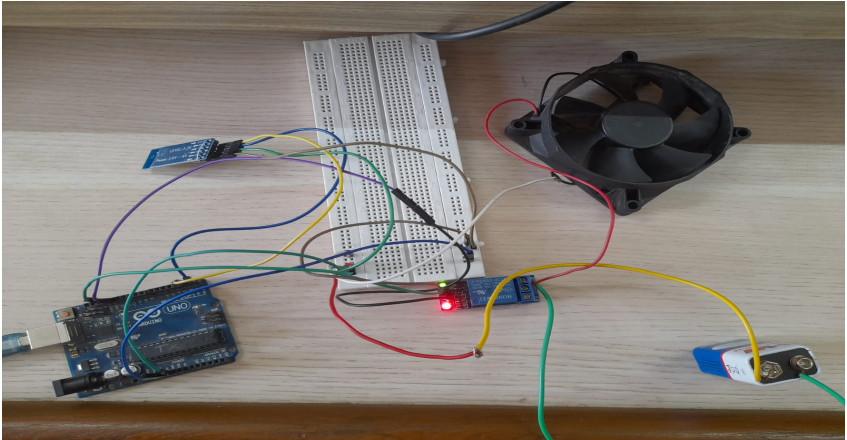

# Home-Automation-Using-PIR-Sensor

## Introduction
The recent development in sensor networks has lead to high uses of sensors
for home automation purposes.

• This project develops an automatic fan switching system by sensing the
presence of human beings.

• The project aims to save electricity and the manual need of fan switching
ON and OFF.

## Problem Statement and Objectives
This project aims to develop an automated fan system using PIR sensor and
HC-05 bluetooth module. It will work depending on the human presence
in the room.

● To build a wireless fan system using HC-05 module and PIR sensor.

● To switch the fan ON if a person is present in the room.

## Proposed Solution
Our proposed system would work without any manual intervention. We are
going to build a system with two bluetooth modules where each of the modules
will act as a master and receiver. The master would sense the human presence
with the help of PIR sensor and the receiver will implement the output which is
turning ON the Fan.

# Group members: 
 - [@Vikas Chaurasiya](https://github.com/vikas-348)
 - [@Mukesh Gupta](https://github.com/mukesh2001)
 - [@Ashly Jonh](https://github.com/ADJ46)
 - [@Himanshu Chaurasiya](https://github.com/Himanshuchaurasiya1234)

# System Design 


The transmitter and receiver are the two components of our project. The signal
will be sent by the transmitter, and the signal will be received by the receiver,
yielding the resultant output of the fan turning on. The transmitter is made up of
three parts: a PIR sensor, an Arduino, and an HC05 Bluetooth transmitter
module. A Dc fan, Arduino, and HC05 Bluetooth module would make up the
receiver

# Circuit Diagram  
## Master Part


## Slave Part


# System requirements
## Hardware requirements
```
1.Arduino Uno R3 sensor (X2)
2.PIR Sensor 
3.HC-05 module(X2)
4.DC Fan 12V
5.12V Battery
6.Relay Module
7.Bradboard (X2) 
```
## Software Requirements 
```
● Windows 7 or above operating system.
● Arduino IDE
```
# Flowchart for Master/Slave


The above image shows the flowchart for the function of an automated fan
using PIR sensor. The PIR sensor would detect human presence, send the signal
Yes or No. If the value is Yes the relay module will switch the circuit Off which
will cause the fan to turn On. If the value is No then there will be no
transmission of signal and the relay module will remain On, making the circuit
remain disconnected.The fan stop function when the power source is turned
OFF.

# Connection of Slave/Receiver


In the above image the GND and the 13V of the arduino are connected with IN
and GND of the relay module respectively.The VCC of the relay module is
connected with the 5V of the arduino.Here HC-05 module acts as a receiver.
The RDX and TDX of HC-05 module is connected with TDX and RDX of
arduino.The GND and VCC of HC-05 module are connected GND and 5V of
arduino.The NC and Common of relay module connected 9V battery and Fan
respectively.The negative part of the battery and positive side of fan is
connected with is connected with 5V of arduino.


# Connection of Master/Transmitter


In the above image the GND and OUT of PIR sensor connected with GND and
13V of arduino respectively.The VCC of PIR sensor is connected with ground
with arduino.
We also used HC-05 bluetooth module which act as a transmitter.The RDX and
TDX of HC-05 bluetooth module is connected with TX and RX of arduino
respectively.The GND and VCC of HC-05 bluetooth module is connected with
GND and 5V arduino respectively

# Human Presence is detected by Master


In the above image the PIR sensor is sensing the human presence and HC-05
module which (acting as a transmitter) sends the signal to another HC-05
receiver module

# Slave starts the Fan


In the above image the HC-05 received signals from the HC-05 transmitter
module and there is relay module which act as the main switching system
between the battery and FAN. After receiving the signal FAN will star


# Conclusion 
Main purpose of home automation systems is to provide ease to people to
control different home appliances and to save electricity, time and money. We
have developed an automated fan system. The purpose of this project was to
build an automated fan with human detector capabilities by using the PIR sensor
which can be implemented in our homes. The work is focused mainly on human
detection, and no other parameter is involved. This system can also be used to
work with heavy home appliances like AC’s with few more modifications.The
system built can be extremely useful for persons of physical disability.

# Documentations:
- [Project PPT](Documents/Project.pptx)
- [Project Report](Documents/Project.pptx)

